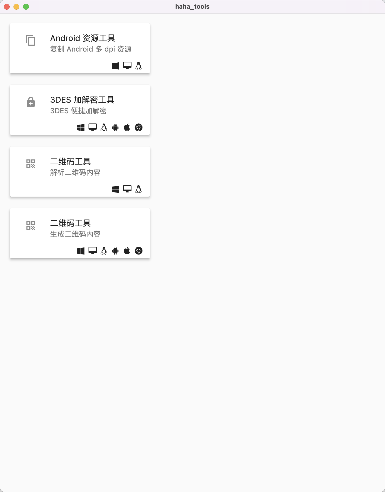

# Haha Tools

*A tool App which can simplify operation for Android developer. Built with [Flutter](https://flutter.dev/).*

**Important:** If you want to build the app by yourself rather than download the release directly, please consider to use the source code from [the main branch](https://github.com/JosephusZhou/haha_tools/tree/main), the develop branch is under development and I cannot guarantee it to be stable.

[](https://github.com/JosephusZhou/haha_tools)
[](https://github.com/JosephusZhou/haha_tools)



## What can it do?

* Android multiple dpi resources copy
* 3DES encrypt and decrypt
* Chinese national encryption algorithm SM4 encrypt and decrypt
* QR code parsing and generation

## How to use it?

To clone and run this repository you'll need [Git](https://git-scm.com) and [Flutter SDK](https://flutter.dev/) installed on your OS. From your command line:

``` bash
# Clone this repository
git clone git@github.com:JosephusZhou/haha_tools.git
# Go into the repository
cd haha_tools
# run the app
flutter run
```

To pack into an app, simply type one of these:

``` shell
flutter build macos
```

#### [Download Released App](https://github.com/JosephusZhou/haha_tools/releases)

#### License [GPL](LICENSE)

*Haha Tools* is free.